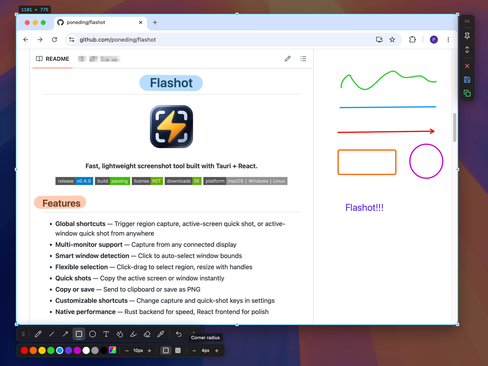

<h1 align="center">Flashot</h1>

<p align="center">
  
</p>

<p align="center">
  <strong>Fast, lightweight screenshot tool built with Tauri + React.</strong>
</p>

<p align="center">
  <a href="https://github.com/poneding/flashot/releases/latest"></a>
  <a href="https://github.com/poneding/flashot/actions"></a>
  <a href="https://github.com/poneding/flashot/blob/main/LICENSE"></a>
  <a href="https://github.com/poneding/flashot/releases"></a>
  
  <a href="https://linux.do" alt="LINUX DO"></a>
</p>

<p align="center">
  
</p>

---

## Features

- **Global shortcuts** — Trigger region capture, active-screen quick shot, or active-window quick shot from anywhere
- **Multi-monitor support** — Capture from any connected display
- **Smart window detection** — Click to auto-select window bounds
- **Flexible selection** — Click-drag to select region, resize with handles
- **Quick shots** — Copy the active screen or window instantly
- **Copy or save** — Send to clipboard or save as PNG
- **Extract text (OCR)** — Offline OCR for Chinese and English text. The ~15 MB PaddleOCR PP-OCRv4 model is downloaded once on first use; recognition then runs locally with no network calls. Trigger via the Toolbar's `Type` button after making a selection.
- **Customizable shortcuts** — Change capture and quick-shot keys in settings
- **Native performance** — Rust backend for speed, React frontend for polish

## Installation

### macOS (Homebrew)

```bash
brew tap poneding/flashot
brew install --cask flashot
```

### macOS (Manual)

1. Download the latest `.dmg` from [Releases](https://github.com/poneding/flashot/releases)
2. Open the `.dmg` and drag Flashot to Applications
3. Grant screen recording permission when prompted (System Settings → Privacy & Security → Screen Recording)
4. Restart Flashot after granting permission

### Windows

1. Download the latest `.exe` installer from [Releases](https://github.com/poneding/flashot/releases)
2. Run the installer
3. Launch Flashot from Start Menu

### Linux

1. Download the latest `.AppImage` from [Releases](https://github.com/poneding/flashot/releases)
2. Make it executable: `chmod +x Flashot-*.AppImage`
3. Run the AppImage

<details>
<summary><strong>Self-signed App on macOS</strong></summary>

Flashot's macOS release builds use a fixed self-signed code-signing certificate. This keeps the app identity more stable across updates than ad-hoc signing, but it is not an Apple Developer ID certificate and is not notarized. macOS Gatekeeper may still block the app on first launch. To resolve this:

**Option A** — Remove the quarantine attribute (recommended):

```bash
xattr -cr /Applications/Flashot.app
```

**Option B** — Right-click to open:

1. Right-click (or Control-click) Flashot.app in Applications
2. Select "Open" from the context menu
3. Click "Open" in the dialog that appears

</details>

## Usage

| Action | macOS | Windows / Linux |
|--------|-------|-----------------|
| Region capture | `Cmd+Shift+A` | `Ctrl+Shift+A` |
| Active screen | `Cmd+Shift+F` | `Ctrl+Shift+F` |
| Active window | `Cmd+Shift+W` | `Ctrl+Shift+W` |

1. Press the region capture shortcut
2. Screen freezes and overlay appears
3. Click and drag to select region, or click a window to auto-select
4. Use the toolbar to copy or Save As, or press **Cmd/Ctrl+C**
5. Press **ESC** to cancel

Quick shots skip the overlay and copy immediately.

## Auto Update

Flashot includes a built-in updater. When a new version is available, you'll be notified through the tray menu "Check for updates" option. The update is downloaded, verified, and installed automatically.

If you installed via Homebrew:

```bash
brew upgrade --cask flashot
```

## Development

### Prerequisites

- **Node.js** 20 LTS and pnpm
- **Rust** 1.83+
- **Platform deps**: Xcode CLI Tools (macOS) / VS Build Tools (Windows)

### Quick Start

```bash
git clone https://github.com/poneding/flashot.git
cd flashot
pnpm install
pnpm tauri dev
```

### Commands

```bash
pnpm tauri dev        # Dev mode (full app)
pnpm tauri build      # Production build
pnpm test             # Frontend tests
pnpm lint             # TypeScript type checking
cd src-tauri && cargo clippy   # Rust linting
cd src-tauri && cargo test     # Rust tests
cd src-tauri && cargo bench    # Benchmarks
```

### Architecture

| Layer | Stack |
|-------|-------|
| Frontend | React + TypeScript + Vite + Tailwind CSS |
| Backend | Rust + Tauri 2 |
| Capture | `xcap` (cross-platform) |
| Hotkey | `global-hotkey` |
| Clipboard | `arboard` |
| Window detection | Core Graphics (macOS) / Win32 (Windows) |

### Release

1. Bump version in `package.json`, `src-tauri/Cargo.toml`, `src-tauri/tauri.conf.json`
2. Commit and tag:

```bash
git tag v0.1.0
git push origin v0.1.0
```

The `.github/workflows/release.yml` workflow builds macOS (ARM + Intel), Windows, and Linux installers, publishes a GitHub Release, then updates `poneding/homebrew-flashot` for non-prerelease releases. Flashot's Rust crate is only used internally by the Tauri app and is not published to crates.io.

The Homebrew update step downloads `Flashot_<version>_aarch64.dmg` and `Flashot_<version>_x64.dmg`, computes their SHA256 hashes, and commits the updated cask to `poneding/homebrew-flashot`. `.github/workflows/homebrew.yml` remains available as a manual recovery workflow.

The release and manual Homebrew workflows require a repository secret named `HOMEBREW_TAP_TOKEN`. Use a fine-grained personal access token with Contents read/write access to `poneding/homebrew-flashot`; the default `GITHUB_TOKEN` cannot push to the separate tap repository.

macOS release builds also require fixed self-signed code-signing secrets. Generate the certificate once and keep the `.p12` file and password backed up so future releases use the same signing identity.

```bash
CERT_PASSWORD="choose-a-long-password" \
  scripts/macos/create-self-signed-codesign-cert.sh /tmp/flashot-codesign.p12
```

Add these GitHub repository secrets from the script output:

- `MACOS_CODESIGN_CERTIFICATE`
- `MACOS_CODESIGN_CERTIFICATE_PASSWORD`
- `MACOS_CODESIGN_IDENTITY`

These secrets are separate from `TAURI_SIGNING_PRIVATE_KEY`, which signs updater artifacts rather than the macOS app bundle.

## Contributing

Contributions welcome! Please:

1. Fork the repository
2. Create a feature branch (`git checkout -b feat/my-feature`)
3. Commit your changes (`git commit -m 'feat: add my feature'`)
4. Push to the branch (`git push origin feat/my-feature`)
5. Open a Pull Request

## License

[MIT](LICENSE)

## Acknowledgments

Built with [Tauri](https://tauri.app/) · [React](https://react.dev/) · [xcap](https://github.com/nashaofu/xcap) · [global-hotkey](https://github.com/tauri-apps/global-hotkey)
